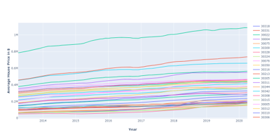
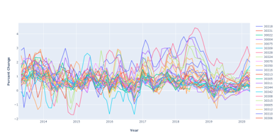
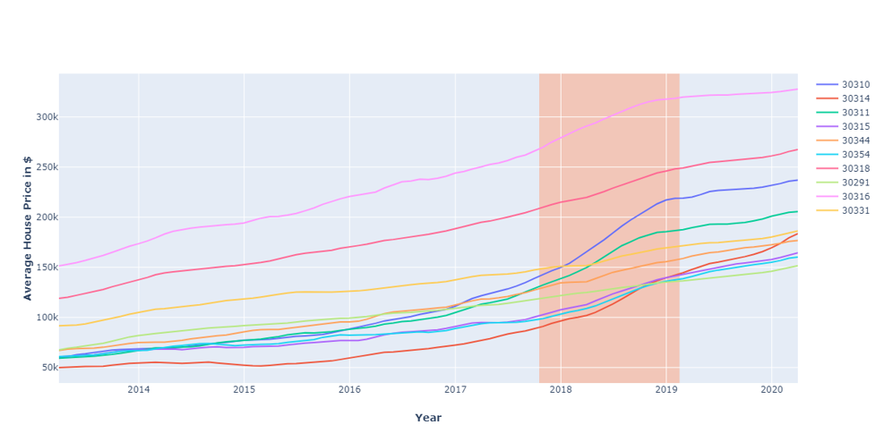
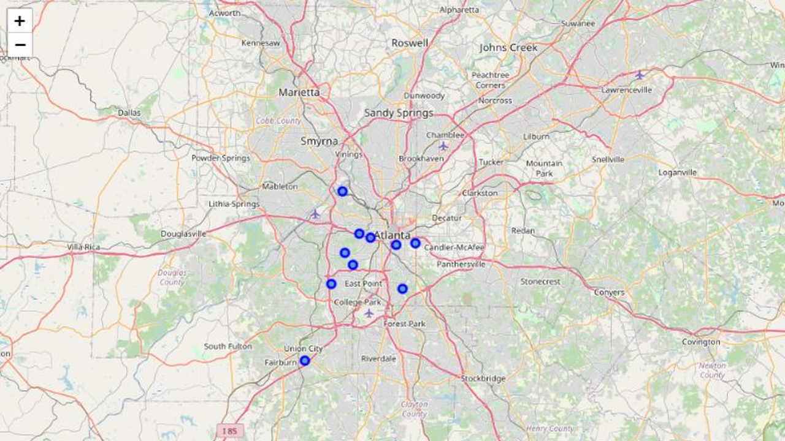
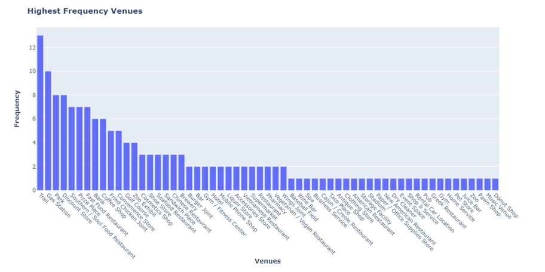
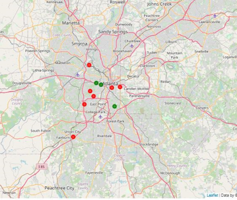
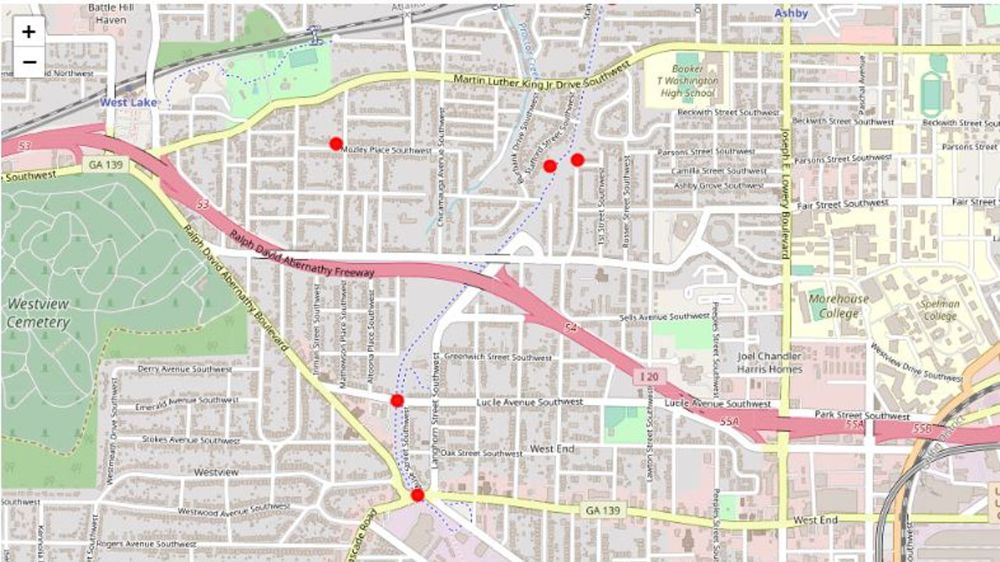
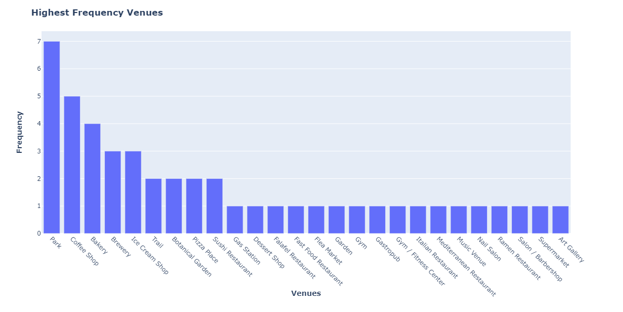
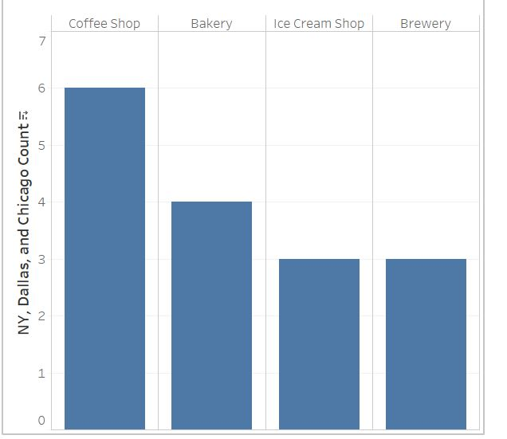

**Business Problem** 

  A venture capitalist has seen the recent housing boom in Atlanta, Georgia and is looking to start a small business in whichever areas have seen pronounced value increase. One assumption this venture capitalist is making, wherever he starts his business will see an increase in public spending as long as it is in a heavily gentrified area. This person is looking to do some initial research to identify those areas in Atlanta that have the highest percentage increase in home value. 
The capitalist is hoping to start a business while business zoned property is still relatively cheap, In order that in 10 years, a large profit can be made when selling. However, this person does not want to compete in a saturated market. Ideally, this initial data would lead into possible ideas and identify what types of business would add the most value to the local neighborhood. 

**Data Introduction**

For this assignment I will be using two data sources. One will be Foursquare venue data pulled from Folium geolocation points, after identifying those zip codes which have been most affected by the boom. The second data set will be pulled from Zillow housing research for average home prices. This data will be filtered to include all of Atlanta. It will need to be historical data, starting after the 2009 housing market crash. Ideally, we would have month by month value for each zip code. 

 
 
 

**Methodology and Analysis** 

I will first be looking at Zillow data to gather the zip codes with the highest increase, pertage, in home value. Then I will separate out those zip codes, geolocate to find their coordinates, and explore venues in the area. After exploring venues, I will analyze for possible business ideas and saturated markets. If further analysis is needed, I will perform that analysis using these two data sources.

 
 
All data for Atlanta and specifically Fulton county zipcodes

 

 
Pct_change function used to see month over month growth - still confusing

 
 
Filtered to show the top ten pct_change zipcodes and joined to $ amount zipcodes - here we can see a clear steep increase

 
 
Using <b>Folium and a geolocater</b> package I mapped these zipcodes - intersting to note they are all in southwest Atlanta

 
 

 
 
Next using <b>FourSquare API</b> I sorted the top venue types in atlanta for exploration
 
 

 
 
I wanted to dig deeper to see where the trail venues were located, so using the geolocation from the FourSquare API:
 
 

 
It appears most of the venues are <b>one</b> trail system - westside Atlanta Beltline
 

 
 

So, it looks as if this trail system is  under developed in terms of venue diversity but I wanted to do a but more exploration on the matter. I retrieved all of the data from more developed trail system venues. Specifically, I looked at Dallas, Chicago, and New York trail systems. Within a 1 miles radius of these trail systems, here are the most prevalent small businesses. 
 

 
Extracting 'park' or 'trail' from the mix and returning the top four small businesses in more developed areas:

